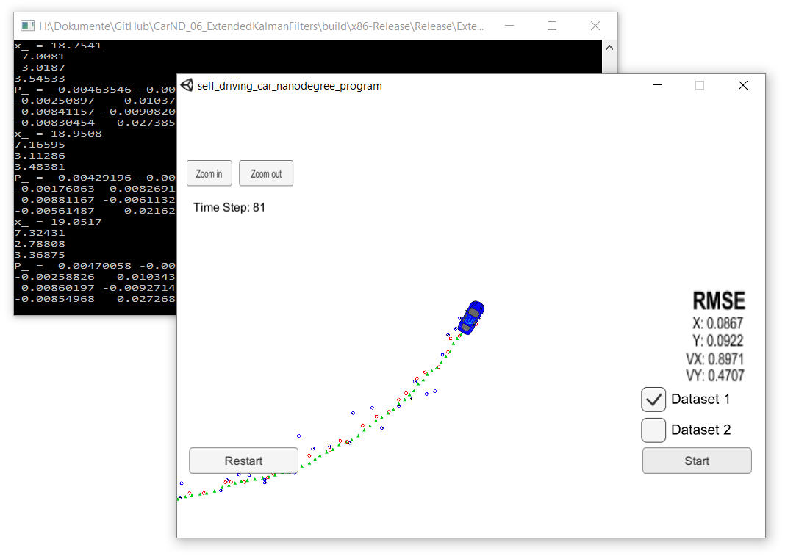

# Self Driving Car Engineer Project 6 - Extended Kalman Filter
## Benjamin Söllner, 02 Aug 2017

---

In this project I am utilizing a kalman filter to estimate the state of a moving object of interest with noisy lidar and radar measurements. Passing the project requires obtaining RMSE values that are lower that the tolerance outlined in the project rubric.

This project involves the Term 2 Simulator which can be downloaded [here](https://github.com/udacity/self-driving-car-sim/releases).

## Dependencies

* [uWebSocketIO](https://github.com/uWebSockets/uWebSockets) for either Linux or Mac systems.
* cmake >= 3.5
  * All OSes: [click here for installation instructions](https://cmake.org/install/)
* make >= 4.1
  * Linux: make is installed by default on most Linux distros
  * Mac: [install Xcode command line tools to get make](https://developer.apple.com/xcode/features/)
  * Windows: [Click here for installation instructions](http://gnuwin32.sourceforge.net/packages/make.htm)
* gcc/g++ >= 5.4
  * Linux: gcc / g++ is installed by default on most Linux distros
  * Mac: same deal as make - [install Xcode command line tools](https://developer.apple.com/xcode/features/)
  * Windows: recommend using [MinGW](http://www.mingw.org/)

## Making

Once the install for uWebSocketIO is complete, the main program can be built and run by doing the following from the project top directory.

1. mkdir build
2. cd build
3. cmake ..
4. make
5. ./ExtendedKF

The project can also be built with Microsoft Visual Studio [according to a useful article from Fahid Zubair](https://medium.com/@fzubair/udacity-carnd-term2-visual-studio-2015-17-setup-cca602e0b1cd).

## Submitted Files

* [``README.md``](README.md), [``readme.html``](readme.html): you are reading it! :)
* [``src/FusionEKF.cpp``](src/FusionEKF.cpp), [``src/FusionEKF.h``](src/FusionEKF.cpp): Kalman filter usage for lidar and radar
* [``src/kalman_filter.cpp``](src/kalman_filter.cpp), [``src/kalman_filter.h``](src/src/kalman_filter.h): Core Kalman filter logic
* [``src/tools.cpp``](src/tools.cpp), [``src/tools.h``](src/tools.h): tools to compute Jacobian matrices and RMSE values
